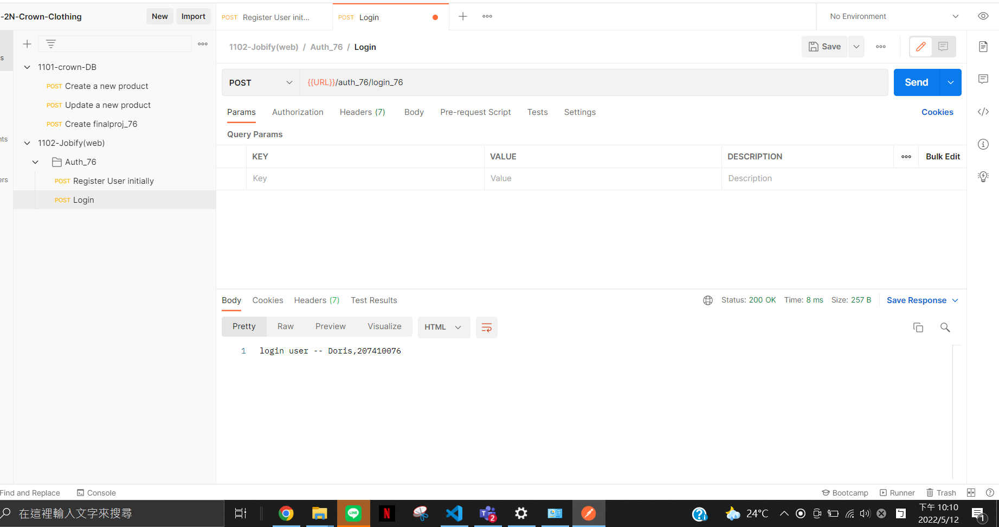
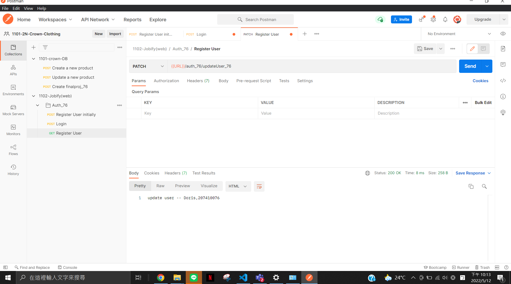
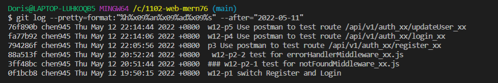

### w12-p1 switch Register and Login, and log


### w12-p2-1 test for notFoundMiddleware_xx.js


### w12-p2-2 test for errorHandlerMiddleware_xx.js


--P3、P4、P5 程式碼放最後--

### w12-p3 Use postman to test route /api/v1/auth_xx/register_xx


### w12-p4 Use postman to test route /api/v1/auth_xx/login_xx



### w12-p5 Use postman to test route /api/v1/auth_xx/updateUser_xx



### P3、P4、P5 的程式碼


###GIT LOG


```
$ git log --pretty=format:"%h%x09%an%x09%ad%x09%s" --after="2022-05-11"
76f890b chen945 Thu May 12 22:14:44 2022 +0800  w12-p5 Use postman to test route /api/v1/auth_xx/updateUser_xx
fa77b92 chen945 Thu May 12 22:14:06 2022 +0800  w12-p4 Use postman to test route /api/v1/auth_xx/login_xx
794286f chen945 Thu May 12 22:05:56 2022 +0800  p3 Use postman to test route /api/v1/auth_xx/register_xx
88a513f chen945 Thu May 12 20:52:24 2022 +0800   w12-p2-2 test for errorHandlerMiddleware_xx.js
3ff48bc chen945 Thu May 12 20:51:44 2022 +0800  ### w12-p2-1 test for notFoundMiddleware_xx.js
0f1bcb8 chen945 Thu May 12 19:50:15 2022 +0800  w12-p1 switch Register and Login
```
