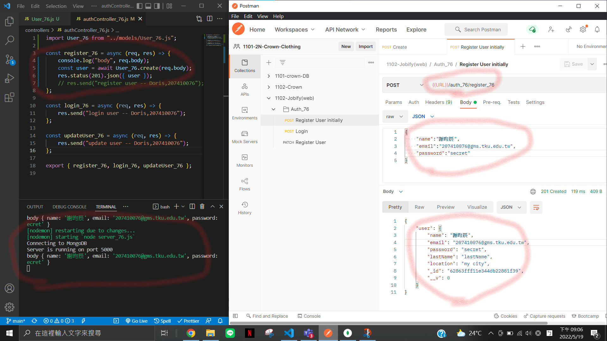
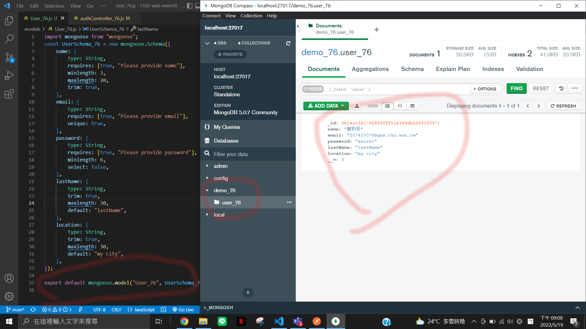
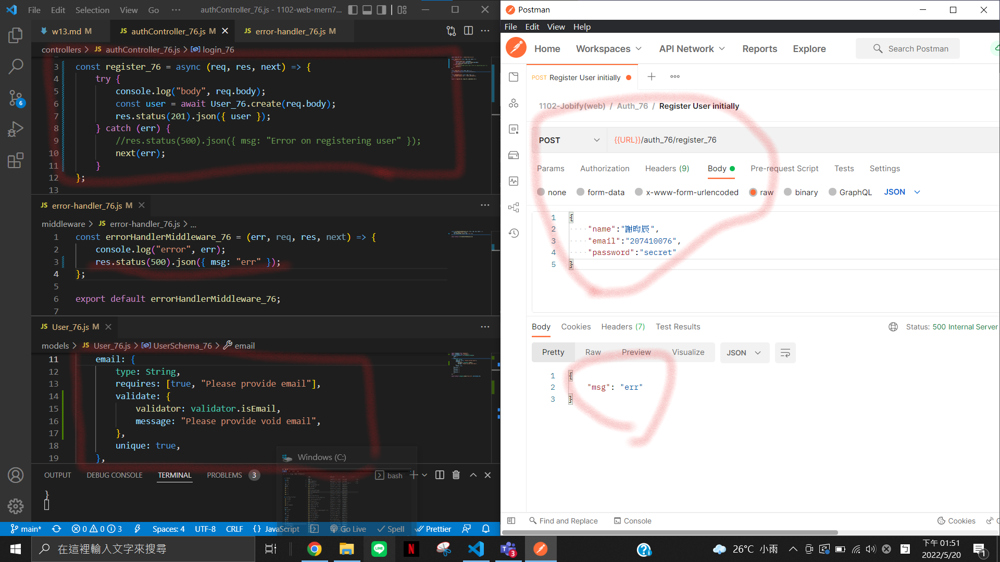
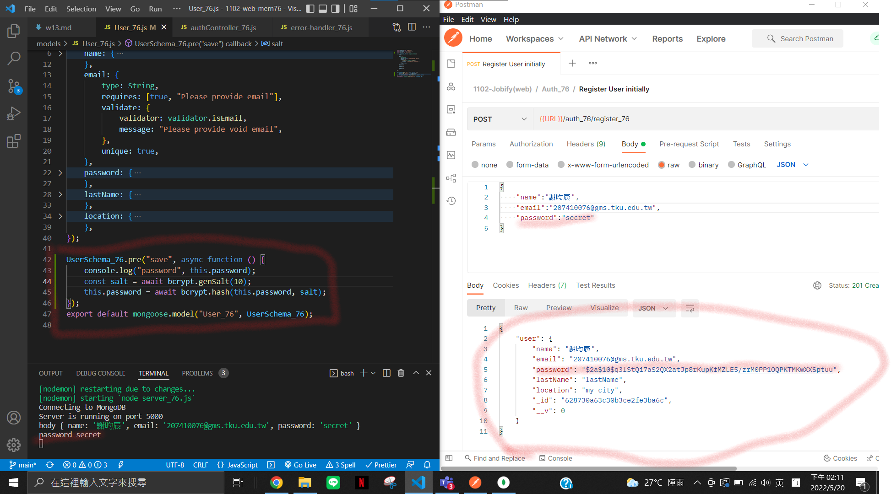
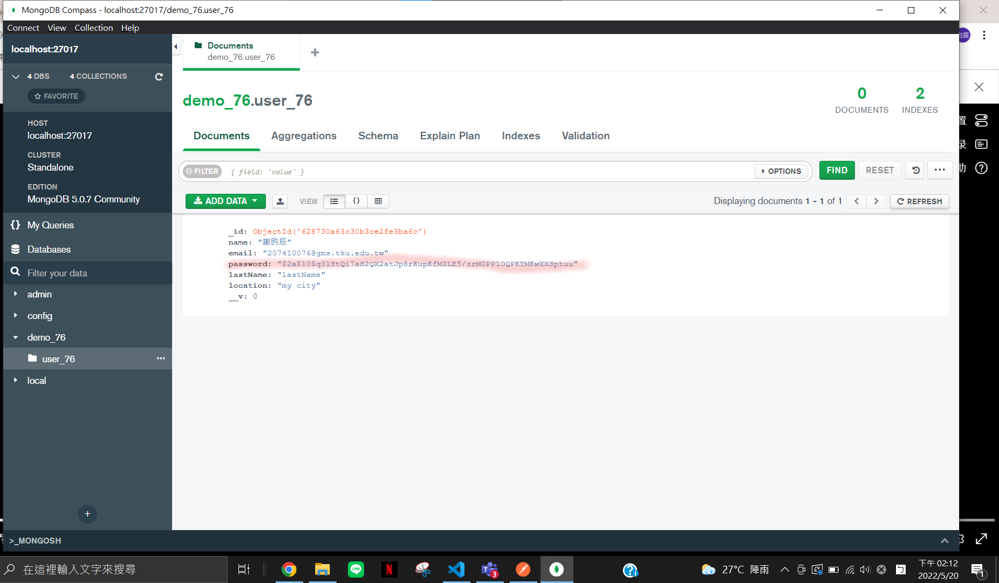
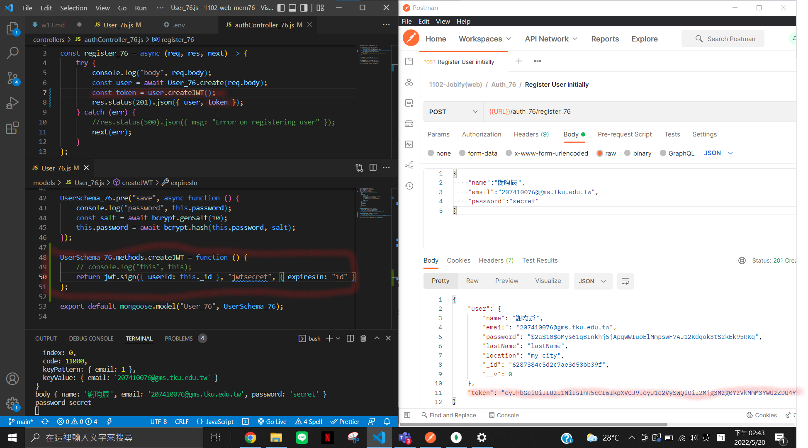
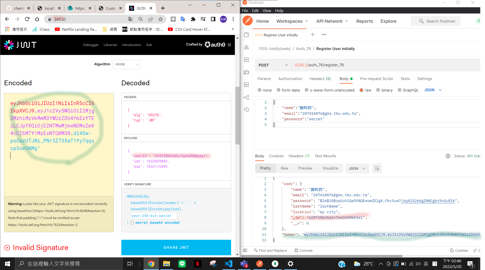
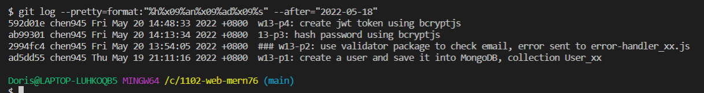

### Github repo URL

https://github.com/chen945/1102-web-mern76

### w13-p1: create a user and save it into MongoDB, collection User_xx




### w13-p2: use validator package to check email, error sent to error-handler_xx.js



### w13-p3: hash password using bcryptjs




### w13-p4: create jwt token using bcryptjs




### p13-last-log



```
$ git log --pretty=format:"%h%x09%an%x09%ad%x09%s" --after="2022-05-18"
592d01e chen945 Fri May 20 14:48:33 2022 +0800  w13-p4: create jwt token using bcryptjs
ab99301 chen945 Fri May 20 14:13:34 2022 +0800  13-p3: hash password using bcryptjs
2994fc4 chen945 Fri May 20 13:54:05 2022 +0800  ### w13-p2: use validator package to check email, error sent to error-handler_xx.js
ad5dd55 chen945 Thu May 19 21:11:16 2022 +0800  w13-p1: create a user and save it into MongoDB, collection User_xx
```
