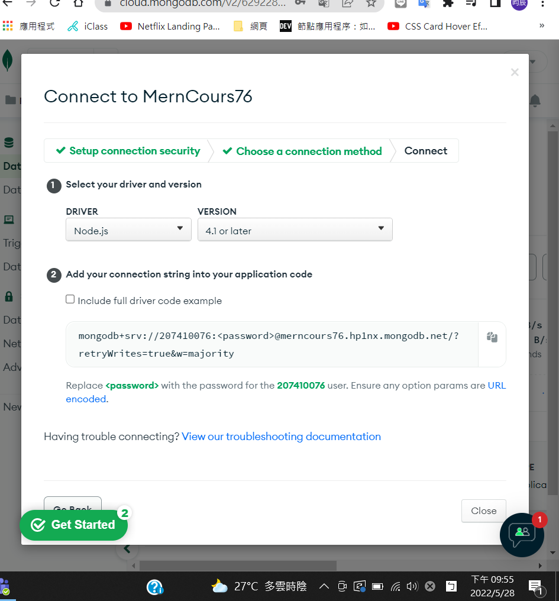
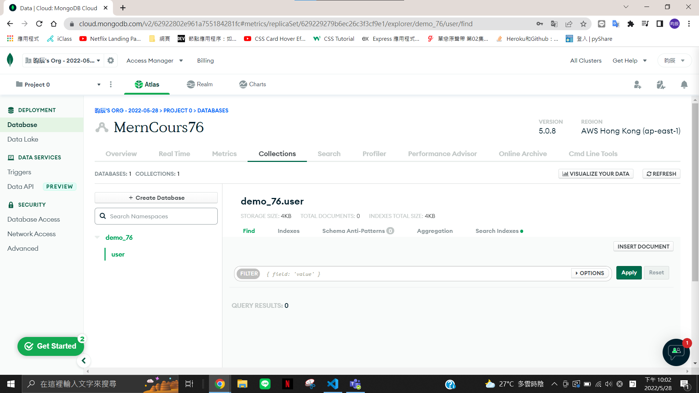
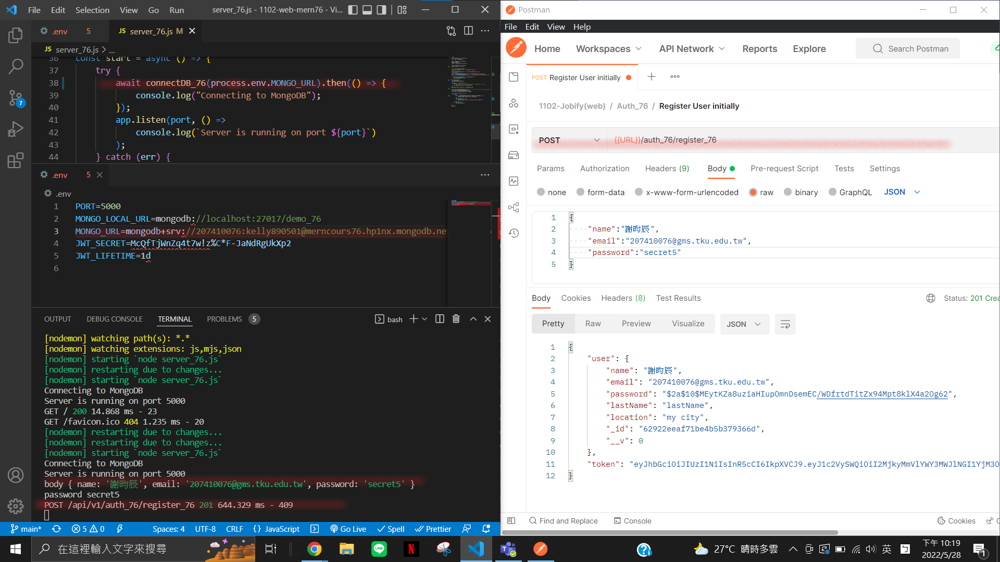
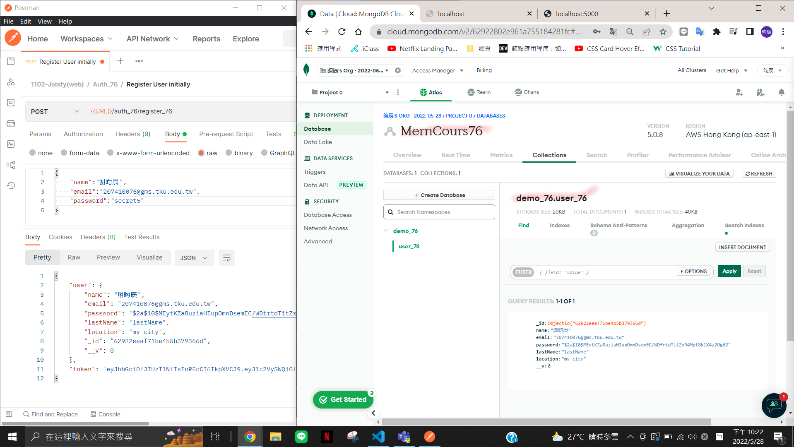
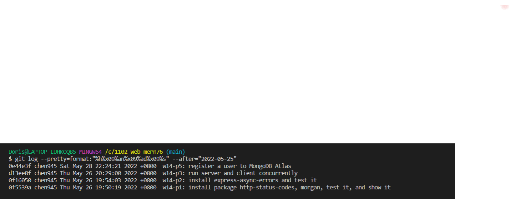

### w14-p1: install package http-status-codes, morgan, test it, and show it


### w14-p2: install express-async-errors and test it


### w14-p3: run server and client concurrently


### w14-p4: create mongodb atlas account





### w14-p5: register a user to MongoDB Atlas




### log



```
0e44e3f chen945 Sat May 28 22:24:21 2022 +0800  w14-p5: register a user to MongoDB Atlas
d13ee8f chen945 Thu May 26 20:29:00 2022 +0800  w14-p3: run server and client concurrently
0f16050 chen945 Thu May 26 19:54:03 2022 +0800  w14-p2: install express-async-errors and test it
0f5539a chen945 Thu May 26 19:50:19 2022 +0800  w14-p1: install package http-status-codes, morgan, test it, and show it
```
