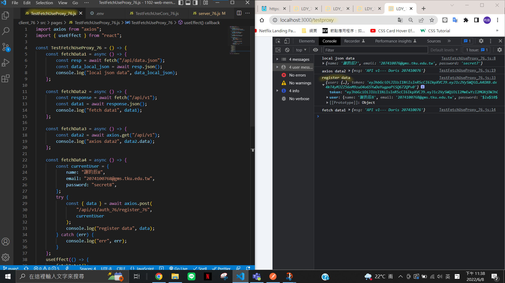
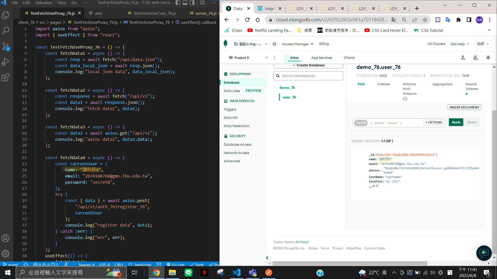
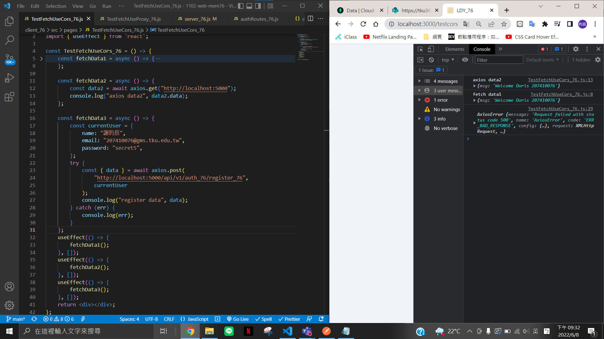
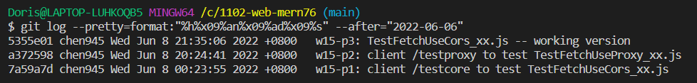

### w15-p1: client /testcore to test TestFetchUseCors_xx.js

---

###### 1. 因第一題已完成後故發現沒抓到 register data 的資料，呈現 err，已在 P3 更正(使用 useEffect 成功抓取到)

###### 2. 無法連至遠端，故先用 local 端跑


### w15-p2: client /testproxy to test TestFetchUseProxy_xx.js

---

###### 1. 已成功解決無法連至遠端的問題，故此題開始皆用遠端跑

###### 2. 依後面老師 useEffect 的方法，使 proxy 可正常跑出 data




### w15-p3: TestFetchUseCors_xx.js -- working version

###### 將 P1 改用 useEffect 的方式



### last log



````
$ git log --pretty=format:"%h%x09%an%x09%ad%x09%s" --after="2022-06-06"
5355e01 chen945 Wed Jun 8 21:35:06 2022 +0800   w15-p3: TestFetchUseCors_xx.js -- working version
a372598 chen945 Wed Jun 8 20:24:41 2022 +0800   w15-p2: client /testproxy to test TestFetchUseProxy_xx.js
7a59a7d chen945 Wed Jun 8 00:23:55 2022 +0800   w15-p1: client /testcore to test TestFetchUseCors_xx.js```
````
