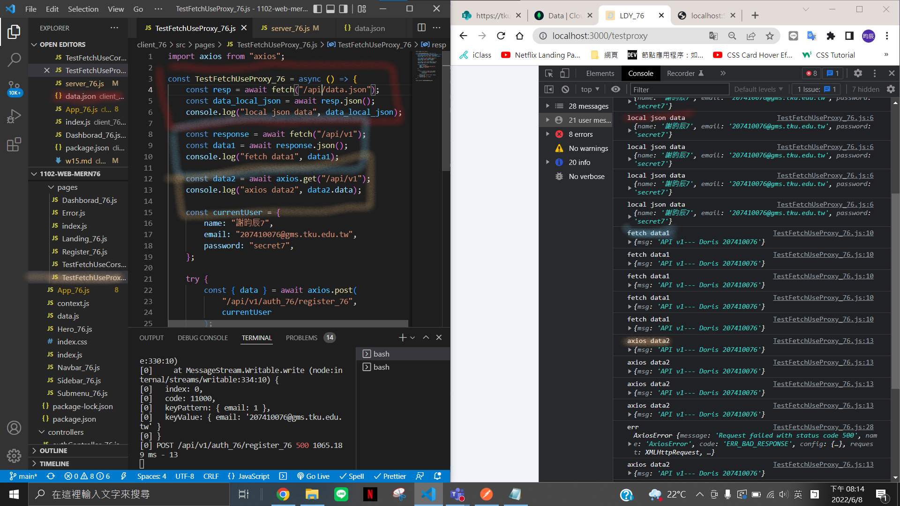

P1 無法連至遠端，突然遠端出現問題，故用 Local 端跑
P2 已解決無法連至遠端的問題

### w15-p1: client /testcore to test TestFetchUseCors_xx.js


### w15-p2: client /testproxy to test TestFetchUseProxy_xx.js




### w15-p3: TestFetchUseCors_xx.js -- working version


### last log


````
$ git log --pretty=format:"%h%x09%an%x09%ad%x09%s" --after="2022-06-06"
5355e01 chen945 Wed Jun 8 21:35:06 2022 +0800   w15-p3: TestFetchUseCors_xx.js -- working version
a372598 chen945 Wed Jun 8 20:24:41 2022 +0800   w15-p2: client /testproxy to test TestFetchUseProxy_xx.js
7a59a7d chen945 Wed Jun 8 00:23:55 2022 +0800   w15-p1: client /testcore to test TestFetchUseCors_xx.js```
````
